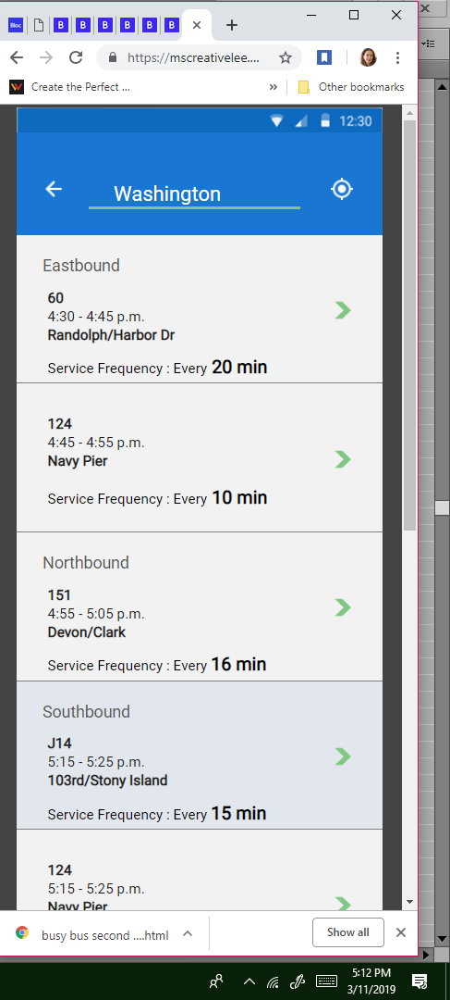

# busybusChallenge

submission of busy bus mobile screen

The Busy Bus challenge is the culmination of a series of checkpoint challenges I performed to create my first UX/ UI design. As part of the challenge, I was already provided the routes and the arrival frequency of the buses that service this bus stop.

SYNOPSIS OF THE CHALLENGE:

Currently in the Chicago area, there are 7 bus lines serving the Washington and State bus stop. Although the city officials have added more bus stops to accommodate the increase in ridership, this has not solved the users problems.

they want to know when the next bus arrives.
together with this, they need to know how much time do they have to be at the bus stop to be able to catch this ride.
How can the UI components show this information?

Requirements:

Code a list-view design appropriate for your chosen operating system (iOS or Android) that incorporates the guidelines for the chosen platform and the visual styling you applied to the Visual Challenge. -Incorporate the routes and arrival frequency of each bus that services the Washington and State bus stop.
Challenges I faced in creating the list-view design.

Redesigning the screen to incorporate the list that was included for this challenge.

How best to represent the not available and the out of service portion bus routes for instance. I was undecided if I should just place the icon   not available and the to show that if the rider wanted to get information about the particular bus line  and then to create additional screens that would explain the delays. However, I decided not to include the additional screens since these two icons are self-explanatory and in keeping with the guidelines of the Material design , which is to use these icons when more detailed information is necessary, requiring more than one sentence to clarify.  To use the information icon which when pressed, will reveal more information.

2. How best to code the screen? It has definitely helped me a lot to remember all the html and css challenges and assignments I have undergone. I have used and reused portions of html & CSS assignments in creating the screen. Just this one central realization, that I don’t need to scour the internet to create a screen. I studied all the codes of the assignments and when appropriate I copied these. I am beginning to have a better understanding of speed and accuracy going together, and that the resources to accomplish my assignments are actually all there, I just need to be faster at picking these lessons up and using them.  Of course the mistakes and learning curve are all mine. I’m just glad that I am getting better at recognizing these cues or procedures to create faster.

3. Not asking the right questions or enough questions to get clarifications. I struggled with creating the status bar by gathering the icons such as the battery charge, the wifi, and Google doesn’t have the icon where that tells time at the status bar. If I had asked earlier instead of trying to recreate the screen with just code - I would have been able to finish a portion of this assignment faster. Which I’ve come to realize, was actually not as difficult as I initially thought it would be.

4. I didn’t keep a work journal for my benefit to document  my design decisions - problems and solutions. I need to become better at this - when you have a detailed list of what you have not accomplished and need to fix, this serves as your guide as you look at the code. I got lost repeatedly because I would write up the decisions that I had made and the problems I had encountered in separate pieces of papers or haphazardly done. My resolution is to keep a daily  working journal so I know where I was last and what I need to do in order to move forward in future assignments and challenges. It is easy to get lost when reading the code if I don’t have a written guide to consult.
Not creating color-coded sketches of the screen. I have kept all of my busy bus wire frames. But these were not color- coded. At first, I tried to recreate the screen by just using these wireframes. But it didn’t work for me. From now on, in whatever application I will be making I am going to create colored sketches that are definitive guides. Having drawings are a great help. I will not go without one from now on.

Lastly, I have an established routine on how to create, which is to first create a working prototype and then to tweak the end product. I will make it a point to have a written guide of all my design decisions. Sticking to the core plan - creating a working model and then to tweaking this afterwards, will save me time. Saves me a lot of time and wrong design decisions. What happened was, I would be lost in the code, and wonder what it was next that I needed to do. I made mistakes like waffling between changing the font size and font-weights. I struggled with creating an unordered list with a table or code using the inline-block (which has become my new best friend). I wasn’t sure if I should create a screen that had media queries. I decided eventually not to.
